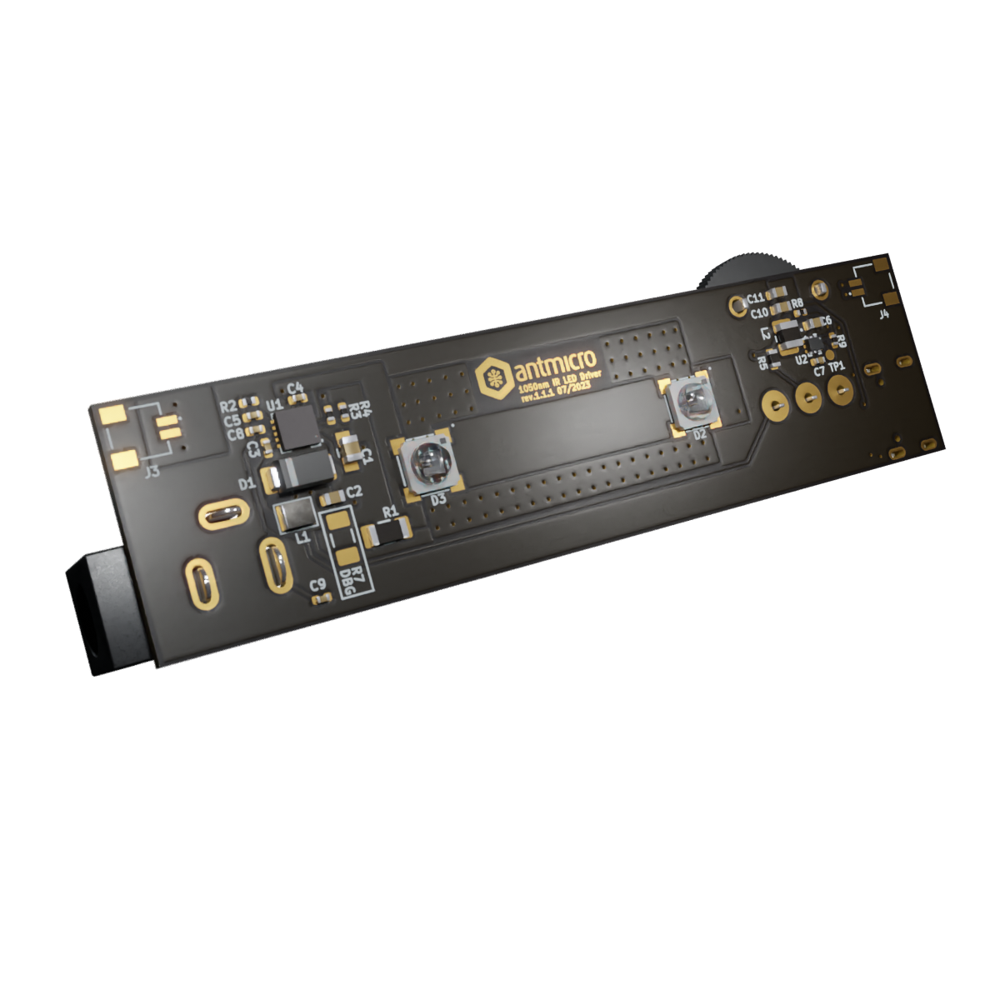

# Flickerless LED driver

Copyright (c) 2023 [Antmicro](https://www.antmicro.com) 

## Overview 

This project contains open hardware design files for a PCB supporting a pair of infrared (IR) LEDs in an LZ1 LuxiGen package from OSRAM.
The PCB includes a flickerless LED driver that allows adjusting LED brightness with a potentiometer.
This design can be easily adopted to other LEDs and eventually can become a custom LED driver providing precise lighting for machine vision applications.
You can read more about flickerless LED driving in a dedicated blog [note](https://antmicro.com/blog/2022/02/machine-vision-with-flickerless-led-lighting/).
The design files were prepared in KiCad 6.x.

## Key features 

* LED current driver implemented with MPS/MP2483DQ-LF-P
* Designed for a pair of LZ1-00R802-0000
* Can be daisy-chained with multiple LEDs driven with a single driver

## Project structure

The main directory contains KiCad PCB project files, a LICENSE, and a README.
The remaining files are stored in the following directories:

* `lib` - contains the component libraries
* `img` - contains graphics for this README
* `assets` - contains visual assets for showcasing this design on [Open Hardware Portal](https://openhardware.antmicro.com).

## Usage

The project contains one PCB that can be configured as a primary or a secondary board, depending on the assembly variant. 
It is designed to be powered with 12V DC using a barrel jack.

### Primary board

This version contains the LED driver, all the connectors and a potentiometer. 

There are 3 connectors located on the primary board:
 
* USB-C - outputs 5V without data transfer, only to power an additional device, i.e. a microscope or a camera
* A barrel jack to power the whole circuit with 12V
* A 2-pin JST connector - to daisy chain boards with diodes in serial connection 

A rotary potentiometer is the element that provides control of diode brightness using the LED driver. 

### Secondary board 

This variant contains only the `LZ1` diodes, 2-pin connectors and resistors marked as secondary DP (`R10` and `R7`). 
It is powered and controlled by the primary board through JST connectors.

### Single board setup

To configure the primary board as a standalone, mount the `R7` Debug jumper in addition to `R11`. 

### Multi board setup

To daisy chain the boards, `R7` CANNOT be populated on the primary board and must be populated on secondary boards. 
`C_out` of one board must be connected to `A_in` of another one.
The design was made for up to 3 boards in a chain.

## Licensing

This project is published under the [Apache-2.0](LICENSE) license.
